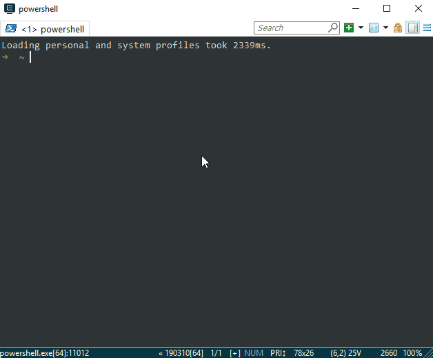

# windows-dotfiles

Uses [oh-my-posh](https://github.com/JanDeDobbeleer/oh-my-posh) and [posh-git](https://github.com/dahlbyk/posh-git) to get that sweet sweet zsh look and git integration. Powershell modules installed from `oobe/ps-modules.ps1`, then `Microsoft.PowerShell_profile.ps1` is added to `%userprofile%/Documents/WindowsPowerShell`.

Look how glorious it is!

On a fresh install, I would usually run the two `.reg` files in `oobe/` to enhance the Windows Explorer shell, and install all the programs I need through [chocolatey](http://chocolatey.org), and from `oobe/chocolatey.ps1`.

Also, I have added vim support so one can finally go `vim sourcecode.js`. Yay! 🎉 Remember to install vim, and point the alias to the correct `vim.exe` location

Might write a script to automate these things one day, still learning Powershell 👩‍💻

Most of the stuff are just taken from elsewhere, so I didn't really create these amazing tools. Kudos to the creators!

## Installing Chocolatey

Taken from the [Chocolatey website](https://chocolatey.org/install).

1. First, ensure that you are using an administrative shell - you can also install as a non-admin, check out Non-Administrative Installation.
2. Install with powershell.exe

> NOTE: Please inspect https://chocolatey.org/install.ps1 prior to running any of these scripts to ensure safety. We already know it's safe, but you should verify the security and contents of any script from the internet you are not familiar with. All of these scripts download a remote PowerShell script and execute it on your machine. We take security very seriously. Learn more about our security protocols.

With PowerShell, you must ensure Get-ExecutionPolicy is not Restricted. We suggest using Bypass to bypass the policy to get things installed or AllSigned for quite a bit more security.

- Run Get-ExecutionPolicy. If it returns Restricted, then run Set-ExecutionPolicy AllSigned or Set-ExecutionPolicy Bypass -Scope Process.

Now run the following command:

`Set-ExecutionPolicy Bypass -Scope Process -Force; [System.Net.ServicePointManager]::SecurityProtocol = [System.Net.ServicePointManager]::SecurityProtocol -bor 3072; iex ((New-Object System.Net.WebClient).DownloadString('https://chocolatey.org/install.ps1'))`

3. Paste the copied text into your shell and press Enter.
4. Wait a few seconds for the command to complete.
5. If you don't see any errors, you are ready to use Chocolatey! Type choco or choco -? now, or see Getting Started for usage instructions.

## Handy references

### Windows Environment Path Variables

More details can be found [here](https://ss64.com/nt/syntax-variables.html)

`%AllUsersProfile%` - Open the All User's Profile C:\ProgramData

`%AppData%` - Opens AppData folder C:\Users\{username}\AppData\Roaming

`%CommonProgramFiles%` - C:\Program Files\Common Files

`%CommonProgramFiles(x86)%` - C:\Program Files (x86)\Common Files

`%HomeDrive%` - Opens your home drive C:\

`%LocalAppData%` - Opens local AppData folder C:\Users\{username}\AppData\Local

`%ProgramData%` - C:\ProgramData

`%ProgramFiles%` -  C:\Program Files or C:\Program Files (x86)

`%ProgramFiles(x86)%` - C:\Program Files (x86)

`%Public%` - C:\Users\Public

`%SystemDrive%` - C:

`%SystemRoot%` - Opens Windows folder C:\Windows

`%Temp%` - Opens temporary file Folder C:\Users\{Username}\AppData\Local\Temp

`%UserProfile%` - Opens your user's profile C:\Users\{username}

`%AppData%\Microsoft\Windows\Start Menu\Programs\Startup` - Opens Windows 10 Startup location for program shortcuts
